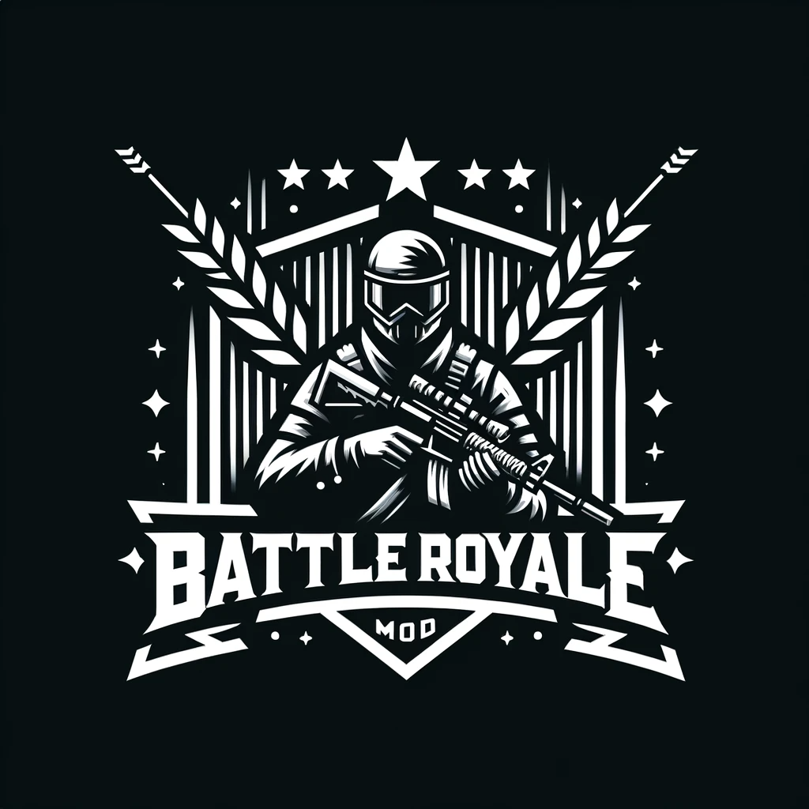
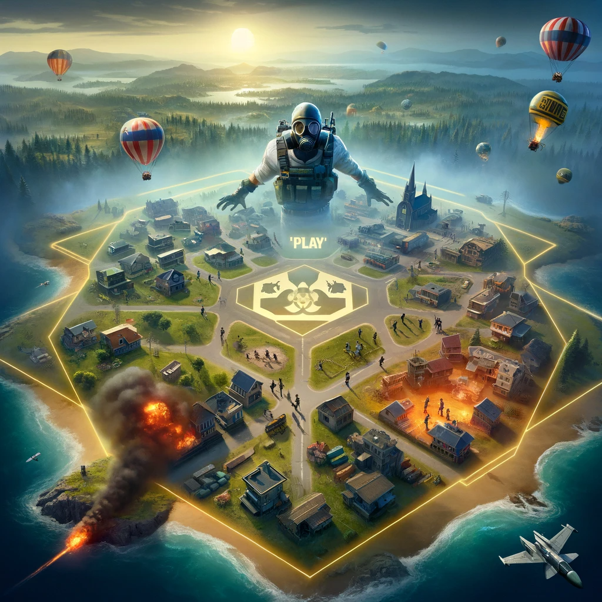
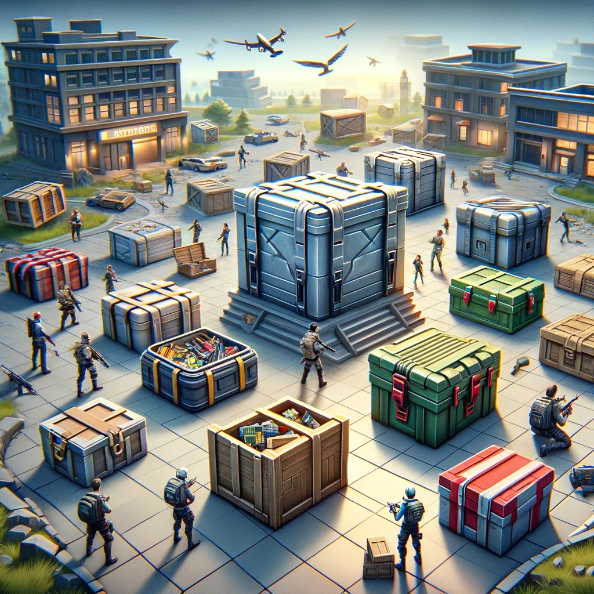

# 🌟 Battle Royale Mod for DayZ: Survival Showdown 🌟

## Introduction
Embark on an unparalleled survival adventure in our Battle Royale mod for DayZ. This mod brings heart-racing action, strategic alliances, and a test of survival skills in a high-stakes environment.

## 🏁 Lobby: The Prelude

- **⏳ Countdown to Confrontation**: A suspense-filled countdown timer (customizable) sets the stage for the battle ahead.
- **👥 Squad Formation**: Players join forces in squads up to 4 members (configurable). A minimum player count is required to initiate the countdown.
- **🔀 Matchmaking Dynamics**: Solo players are seamlessly integrated into squads with available slots, ensuring full participation.

## 🕹️ Play: The Battle Unfolds

- **📍 Team Deployment**: Squads are strategically deployed together, emphasizing teamwork from the start.
- **🚀 Evolving Challenges**: The game progresses through multiple phases:
  - **🌐 Zones of Safety and Danger**: Each phase is marked by a safe radius. Straying into the toxic zone beyond it spells doom.
  - **🔥 Converging Battleground**: Safe zones shrink over time, driving players into an intense, confined space.

## 💥 Loot System: Riches of the Battlefield

- **🎁 Revamped Looting**: Traditional DayZ looting is replaced with crate spawning in buildings.
  - **🔓 The Loot Unveiling**: Crates reveal a variety of equipment upon opening, reminiscent of Call of Duty's system.
  - **🌈 Crate Variety**: Crate types dictate the rarity and quality of the loot.

## ☠️ Toxic Gas Zone: The Lethal Perimeter

- **Deadly Boundaries**: The gas zones form a lethal barrier, causing significant damage to any player who dares to venture into them.
- **Dynamic Constriction**: These zones dynamically shrink the playable area, forcing players into closer combat and strategic play.
- **Visual Menace**: The toxic gas is visually distinct, creating a palpable sense of danger and urgency.
- **Strategic Gameplay**: Players must constantly adapt their strategies, balancing the risks of the toxic zone against the potential rewards of staying within the safe area.

## 🪂 Airdrop System: Gifts from the Sky

- **🌠 Randomized Airdrops**: Periodically, airdrops deliver high-value resources at random locations across the map.
- **📍 Strategic Importance**: These airdrops become focal points for intense skirmishes, offering high-reward gear.
- **🔔 Alert Mechanism**: Players are alerted to incoming airdrops, adding an element of urgency and strategy.
- **🛠️ Configurable Frequency**: The frequency and contents of airdrops are fully customizable to maintain balance and enhance gameplay dynamics.

Dive into a world where strategy, skill, and a bit of luck determine the ultimate survivor. Prepare for an experience like no other in this enhanced Battle Royale mod for DayZ.
